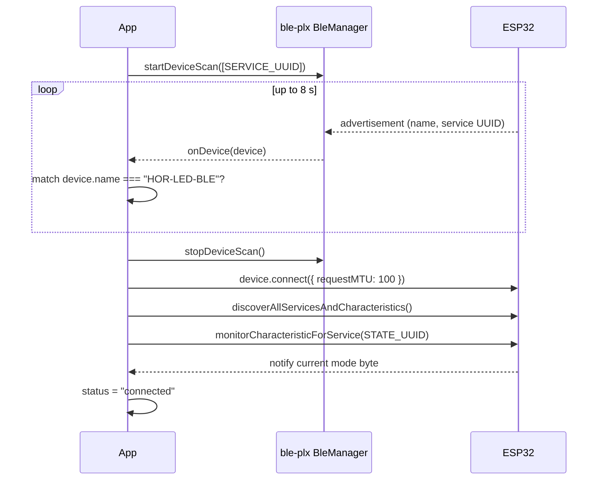

# BLE LED Controller (Expo)

React Native + Expo app that controls the ESP32 onboard LED over BLE
GATT. Paired with the firmware in
[`modules/06-wireless-ble/`](../../modules/06-wireless-ble/).

Four modes: **off**, **on**, **slow blink**, **fast blink**. The ESP32
notifies its confirmed state back to the app, so the UI always reflects
the truth.

## Stack

- Expo SDK **57** (scaffolded via `pnpm create expo-app --template default@sdk-57`).
- React Native 0.86, TypeScript strict.
- expo-router (file-based routing).
- `react-native-ble-plx` for BLE (requires a dev build — see below).
- `@react-native-async-storage/async-storage` for persisted settings.
- `expo-network` for the informational network-state panel in Settings.

## Quick start

```bash
cd apps/ble-led-controller
pnpm install
```

BLE is a native module, so you cannot use Expo Go. You need a custom
dev client. One-time setup:

```bash
pnpm expo prebuild --clean
pnpm ios         # builds + runs on iOS simulator/device
# or
pnpm android     # builds + runs on Android device (BLE won't work in an emulator)
```

After that, `pnpm start` opens the dev server against your new dev client.

## Using it

1. Flash the ESP32 firmware:
   ```bash
   cd modules/06-wireless-ble/platforms/esp32
   pio run --target upload && pio device monitor
   ```
   Confirm you see `[ble] advertising as HOR-LED-BLE`.
2. Open the app on your phone → **LED** tab → tap **Connect**.
3. Tap **Off / On / Slow / Fast**. The active tile fills coral. The
   ESP32 notifies its confirmed state so if the write races with a
   disconnect you'll see it snap back.

---

## How the app finds and connects to the ESP32

There are two paths — the everyday one (using a hard-coded name) and the
discovery one (scan and pick).

### Path A — connect by hard-coded name (default)

The app stores a **BLE device name** in AsyncStorage. The default is
`HOR-LED-BLE`, which matches `kDeviceName` in
[`modules/06-wireless-ble/platforms/esp32/src/main.cpp`](../../modules/06-wireless-ble/platforms/esp32/src/main.cpp).

When you tap **Connect** on the LED screen, the transport
(`src/transports/ble.ts`) runs the four canonical BLE steps:



Key points:

- **The scan filter is the service UUID, not the name.** The name isn't
  guaranteed to be in the first advertising packet — on iOS the name
  usually arrives in the scan response frame, which fires later. Filtering
  on `HOR_LED_SERVICE_UUID` keeps the scan cheap and correctly finds
  every LED firmware in range.
- **The name match is the final identity check.** With the service UUID
  narrowing the candidates to LED firmwares, we then insist on the exact
  advertised name so multiple ESP32s in the same room don't collide.
- **`requestMTU: 100`** raises the negotiated MTU from the default 23 B
  to 100 B. Not needed for this 1-byte protocol, but a good habit for
  when characteristics get bigger.
- **`discoverAllServicesAndCharacteristics()` is mandatory before any
  read/write/subscribe.** ble-plx enforces this — the OS needs to build
  its internal handle table.
- **Subscribing to the NOTIFY characteristic** is what makes the UI feel
  live. Every time the ESP32 changes mode (from *any* client), we get a
  callback and update the badge.

### Path B — discovery (Settings → Discover)

The default name works out of the box, but you may want to:

- Rename the firmware (`kDeviceName` in `main.cpp`) to run multiple
  ESP32s side-by-side.
- Debug why the app isn't finding your board — a scan shows what the OS
  actually sees.

The Settings tab has a **Discover nearby devices** button under the BLE
name input. Tapping it:

1. Starts a filtered scan (still filtered by our service UUID, so
   unrelated BLE devices — headphones, watches, air tags — do NOT appear).
2. Streams a live-updating list of every HOR-LED-BLE peripheral in
   range, sorted by RSSI (closest first).
3. Each row shows `name · id · rssi`. Tap one and its name is written
   into the input; the panel collapses.
4. Head back to the LED screen and tap Connect.

Under the hood: `src/transports/ble-scanner.ts` owns a `LedBleScanner`
class that manages the scan lifecycle (deduping by device id,
auto-stopping after 10 s so battery isn't drained if you forget). The
React hook `use-scanner.ts` wraps it for the UI.

### What the two paths share

Both go through the same singleton `BleManager`
(`src/transports/ble-manager.ts`). ble-plx wants exactly one manager per
app — starting a second breaks Android in subtle ways.

Both are filtered by **service UUID** (never by name at the scan
level). Both dedupe by `device.id`, which is a MAC address on Android
and a stable-per-session UUID on iOS.

## Runtime state model

There are two Redux-free state machines in the app:

**Transport** (`BleStatus`):
```
disconnected → connecting → connected
       ↑            ↓          ↓
       ←────────── error ←─────┘
```

**Scanner** (`ScannerSnapshot`):
```
idle → scanning → idle
        ↓
       error
```

Both are exposed to React via subscribe/emit hooks
(`use-transport.ts`, `use-scanner.ts`). No global state library — the
LED screen owns one transport, the Settings screen owns one scanner,
neither knows about the other.

## Wire protocol

Matches the firmware exactly (see [`modules/06-wireless-ble/README.md`](../../modules/06-wireless-ble/README.md#wire-protocol)):

| Char    | UUID              | Op                 | Payload                                            |
| ------- | ----------------- | ------------------ | -------------------------------------------------- |
| Service | `9a70b2e0-…-0001` | —                  | —                                                  |
| Mode    | `9a70b2e0-…-0002` | WRITE / WRITE_NR   | 1 byte: 0=off, 1=on, 2=slow, 3=fast                |
| State   | `9a70b2e0-…-0003` | READ + NOTIFY      | 1 byte: current mode as confirmed by the firmware  |

The app writes with `WRITE_NR` (write-without-response) for latency and
subscribes to NOTIFY for confirmation.

## Permissions

The `react-native-ble-plx` config plugin in `app.json` sets up:

- **iOS**: `NSBluetoothAlwaysUsageDescription` shown at first BLE use.
- **Android**: `BLUETOOTH_CONNECT` and `BLUETOOTH_SCAN` runtime
  permissions (Android 12+). Older Android additionally needs
  `ACCESS_FINE_LOCATION` — the plugin handles that too.

If you change the permission set, you must **re-run `pnpm expo prebuild`**
and rebuild the dev client — permissions live in the native manifests,
not the JS bundle.

## Why `expo-network` shows up in Settings

Bluetooth isn't a "network" in Expo's sense; `expo-network` reports
Wi-Fi / cellular / airplane-mode state and has **nothing to do with BLE**.
It's on the Settings screen purely as a teaching hook — the Module 05
Wi-Fi companion (`apps/robot-car-controller`) uses the same API to reach
its Axum server, so it's worth being aware of.

## File layout

```text
src/
├── app/
│   ├── _layout.tsx            # tab navigator + gesture root
│   ├── index.tsx              # LED Control screen
│   └── explore.tsx            # Settings screen
├── design/                    # reusable, protocol-agnostic primitives
│   ├── tokens.ts              # palette, spacing, shadows, useTokens()
│   ├── typography.tsx         # Eyebrow / Title / Body / Caption / Mono
│   ├── card.tsx, pill-button.tsx, status-pill.tsx, screen-header.tsx
│   ├── section.tsx, settings-row.tsx, color-utils.ts
│   └── led-bulb.tsx           # animated hero LED
├── features/led/              # LED-specific composed pieces
│   ├── mode-card.tsx, mode-glyph.tsx, mode-grid.tsx
│   ├── ble-status-chip.tsx    # adapter: BleStatus → StatusPill props
│   └── discover-panel.tsx     # "Discover nearby devices" UI
├── hooks/
│   ├── use-settings.ts        # AsyncStorage-backed device name
│   └── use-network-info.ts    # expo-network wrapper
├── protocol/
│   └── led.ts                 # UUIDs + LedMode + labels/descriptions
└── transports/
    ├── ble-manager.ts         # shared BleManager singleton
    ├── ble.ts                 # LedBleTransport (scan → connect → notify)
    ├── useTransport.ts        # React glue for transport status
    ├── ble-scanner.ts         # LedBleScanner (discovery only)
    └── use-scanner.ts         # React glue for scanner state
```

## Two Expo apps in the repo?

Yes:

| App                                    | Module | Transport                    | Purpose                                     |
| -------------------------------------- | ------ | ---------------------------- | ------------------------------------------- |
| `apps/ble-led-controller` (this app)   | 06     | BLE only                     | Learn BLE GATT — 4-state LED, no motors     |
| `apps/robot-car-controller`            | 07     | BLE **or** WebSocket         | Drive a car — joystick + differential drive |

Different lifecycles, different threat models (car needs a watchdog,
LED doesn't). Sharing a codebase would force one app's churn on the
other. If you find yourself building a third mobile app for the
curriculum, that's the right time to extract a common package.
