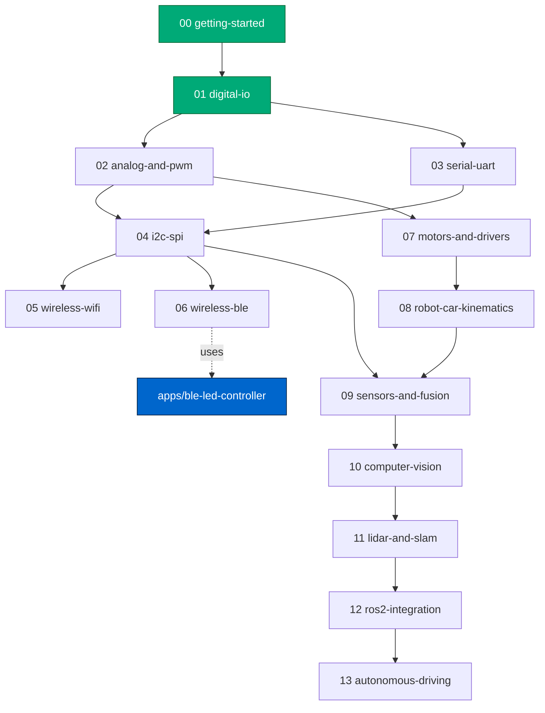

# Curriculum

The curriculum is a single ladder. Each module is self-contained but
assumes you understood the previous one.

## Prerequisite graph

Modules in green are implemented; the rest are planned.

## Status

| #  | Module                 | Status      | Folder                                                              |
| -- | ---------------------- | ----------- | ------------------------------------------------------------------- |
| 00 | getting-started        | implemented | [`modules/00-getting-started`](../modules/00-getting-started/)      |
| 01 | digital-io             | implemented | [`modules/01-digital-io`](../modules/01-digital-io/)                |
| 02 | analog-and-pwm         | planned     | —                                                                   |
| 03 | serial-uart            | planned     | —                                                                   |
| 04 | i2c-spi                | planned     | —                                                                   |
| 05 | wireless-wifi          | planned     | —                                                                   |
| 06 | wireless-ble           | planned     | — (companion app scaffolded in [`apps/ble-led-controller`](../apps/ble-led-controller/)) |
| 07 | motors-and-drivers     | planned     | —                                                                   |
| 08 | robot-car-kinematics   | planned     | —                                                                   |
| 09 | sensors-and-fusion     | planned     | —                                                                   |
| 10 | computer-vision        | planned     | — (will refactor face-detection code from the older Raspberry-Pi-Codes repo) |
| 11 | lidar-and-slam         | planned     | —                                                                   |
| 12 | ros2-integration       | planned     | —                                                                   |
| 13 | autonomous-driving     | planned     | —                                                                   |

## Module slots vs folders

The folder `modules/02-analog-and-pwm/` is **not** created until module 02 is
actually implemented. Reserving numbers in this table (without empty folders)
keeps the repo from looking abandoned.

## Adding a module

See [`CONTRIBUTING.md`](../CONTRIBUTING.md#adding-a-new-module).
