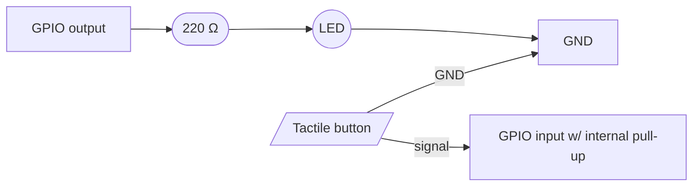

# Module 01 — Digital I/O

## Goal

Wire a tactile button and an LED to your board. Pressing the button
**toggles** the LED on or off. The implementation introduces debouncing
and contrasts polling vs interrupt-driven input — two techniques you'll
use in nearly every future module.

This is also the **template module**. Every later module is structured
exactly like this one — copy this folder and modify.

## Concepts

- GPIO direction (input vs output) and pull-resistor configuration.
- Mechanical switch bounce and how to filter it (software debounce).
- Polling vs interrupt-driven input: the trade-offs.
- Hardware-abstraction so the same logic runs on a real Pi and a mock GPIO
  during unit tests.

## Prerequisites

- [Module 00 — Getting Started](../00-getting-started/) (toolchain verified for your board).
- Familiarity with whichever board you're using — see [`docs/hardware/`](../../docs/hardware/).

## Hardware Matrix

| Board               | Folder                                                                  | Style          | Pins (button → LED)          |
| ------------------- | ----------------------------------------------------------------------- | -------------- | ---------------------------- |
| Arduino Uno         | [`platforms/arduino-uno`](./platforms/arduino-uno/)   | interrupt + debounce | D2 → D13              |
| ESP32 (DevKit V1)   | [`platforms/esp32`](./platforms/esp32/)               | interrupt + debounce | GPIO 4 → GPIO 2       |
| Raspberry Pi Pico   | [`platforms/pico`](./platforms/pico/)                 | interrupt + debounce | GPIO 14 → GPIO 25     |
| Raspberry Pi Zero W | [`platforms/rpi-zero-w`](./platforms/rpi-zero-w/)     | polling + debounce | GPIO 27 → GPIO 17      |
| Raspberry Pi 4 (2GB)| [`platforms/rpi-4`](./platforms/rpi-4/)               | (reuses Zero W code) | GPIO 27 → GPIO 17     |
| Jetson Nano         | [`platforms/jetson-nano`](./platforms/jetson-nano/)   | polling + debounce | GPIO 23 → GPIO 18      |

## Bill of Materials

See [`bom.md`](./bom.md). In short: a 5 mm LED, a 220 Ω resistor, a
tactile push-button, and a few jumper wires.

## Wiring



The button connects the input pin to GND when pressed; the internal
pull-up holds it HIGH when released. A 220 Ω resistor limits LED current.

Per-board wiring SVGs live in [`wiring/`](./wiring/) (one per board family).

## Build & Run

### Microcontrollers

```bash
cd modules/01-digital-io/platforms/<board>
pio run --target upload
pio device monitor
```

### Raspberry Pi (Zero W / 4)

On the Pi:

```bash
uv sync --extra m01-rpi-zero-w        # or m01-rpi-4
uv run python modules/01-digital-io/platforms/rpi-zero-w/src/main.py
```

### Jetson Nano

On the Jetson:

```bash
uv sync --extra m01-jetson-nano
uv run python modules/01-digital-io/platforms/jetson-nano/src/main.py
```

### Tests (Python variants)

```bash
uv run pytest modules/01-digital-io/tests/
```

Tests use `MockGpio` from `hor_common` — no hardware required.

## Expected Behavior

- Power on / start the script: LED is OFF, console prints `ready`.
- Press the button once: LED turns ON, console prints `toggle → on`.
- Press it again: LED turns OFF, console prints `toggle → off`.
- Holding the button does NOT cause repeated toggles — only the falling
  edge counts (one toggle per press).
- Quick double-clicks register as exactly two toggles, not 4–6, because of
  the debounce filter.

## Common Pitfalls

- **LED stays on regardless of button** — you forgot the current-limiting
  resistor and burned the LED, or you wired it backwards (cathode is the
  shorter leg / flat side).
- **Button toggles 3–8 times per press** — debounce isn't working. Check
  that `kDebounceMs` (MCUs) / `DEBOUNCE_S` (Python) is at least 20 ms.
- **Floating input on Arduino** — D2 reads random values when the button
  is released. Solution: `pinMode(BTN_PIN, INPUT_PULLUP)`.
- **ESP32: button on GPIO 0** — works, but pulls boot mode low on reset.
  Use GPIO 4 (or any non-strapping pin).
- **RPi `lgpio` permission denied** — re-run `./scripts/platform/rpi-setup.sh`
  or add yourself to the `gpio` group.

## Next Module

[Module 02 — Analog and PWM](../02-analog-and-pwm/) — fade the LED instead of toggling it, sweep a servo, read an ADC.
*(Planned — see [`docs/curriculum.md`](../../docs/curriculum.md).)*
