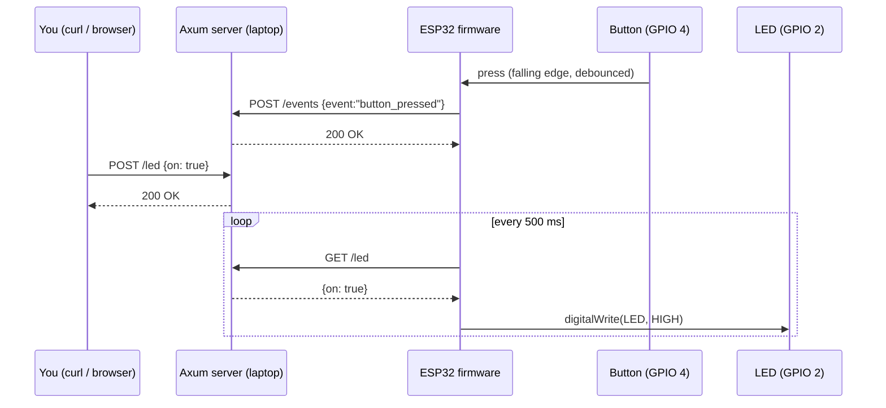

# Module 05 — Wireless Wi-Fi

## Goal

Get the ESP32 talking to a real HTTP server over Wi-Fi. Two parallel
mini-projects, each with its own ESP32 firmware and its own minimal
**Axum (Rust)** server:

1. [`projects/01-telemetry-uplink`](./projects/01-telemetry-uplink/) — fire-and-forget. Every 5 seconds the
   ESP32 POSTs a JSON heartbeat to the server. Easiest possible
   ESP32 → cloud pattern.
2. [`projects/02-bidirectional-control`](./projects/02-bidirectional-control/) — two-way. A button press on the
   ESP32 POSTs an event to the server; the server holds a desired LED
   state that the ESP32 polls every 500 ms. A `curl -X POST .../led`
   from your laptop flips the onboard LED on the ESP32.

Currently ESP32-only (specifically tested on the ESP32-WROOM-32D — but
should work on any DOIT-style dev kit). Raspberry Pi / Jetson variants
are planned.

## Concepts

- Joining a Wi-Fi network from firmware (`WiFi.begin`, status polling, retry).
- HTTP client basics (`HTTPClient` for Arduino-ESP32).
- JSON encoding/decoding (`ArduinoJson` on the device, `serde` on the server).
- A real, small Axum server: routing, state with `Arc<Mutex<…>>`, serving HTML + JSON.
- Two integration patterns: **push** (uplink) and **pull** (polling for commands).

## Prerequisites

- [Module 00](../00-getting-started/) — your ESP32 toolchain works.
- [Module 01](../01-digital-io/) — button + LED on the ESP32 (project 02 reuses the same wiring).
- A Rust toolchain on your laptop (`rustup` from https://rustup.rs).
- The ESP32 and your laptop on the **same Wi-Fi network**, so the firmware can reach the server's IP.

## Hardware Matrix

| Board               | Folder                                                       | Status         |
| ------------------- | ------------------------------------------------------------ | -------------- |
| ESP32 (WROOM-32D)   | `projects/*/platforms/esp32/`                                | implemented    |
| Arduino Uno         | —                                                            | not applicable (no Wi-Fi) |
| Raspberry Pi Pico W | —                                                            | planned        |
| RPi Zero W / 4      | —                                                            | planned (Python `requests` + Axum) |
| Jetson Nano         | —                                                            | planned        |

## Bill of Materials

See [`bom.md`](./bom.md). Same parts as Module 01 plus an active Wi-Fi
network.

## Wiring

- **Project 01**: no external wiring. Onboard LED on GPIO 2 may blink to
  indicate POST success/failure.
- **Project 02**: identical to Module 01 — button on GPIO 4 → GND
  (internal pull-up), LED on GPIO 2 → 220 Ω → GND. See
  [`../01-digital-io/wiring/mcu.svg`](../01-digital-io/wiring/mcu.svg).

## Build & Run

Each project has its own README with full steps. Quick summary:

```bash
# --- Project 01 — uplink only -----------------------------------------------
cd modules/05-wireless-wifi/projects/01-telemetry-uplink/server
cargo run                                 # http://0.0.0.0:8080
# (then in another shell, edit firmware/src/secrets.h with your Wi-Fi creds + server IP)
cd ../platforms/esp32
pio run --target upload && pio device monitor

# --- Project 02 — bidirectional --------------------------------------------
cd modules/05-wireless-wifi/projects/02-bidirectional-control/server
cargo run                                 # http://0.0.0.0:8080
cd ../platforms/esp32
pio run --target upload && pio device monitor

# In a third shell, flip the LED with curl:
curl -X POST http://<laptop-ip>:8080/led -H 'content-type: application/json' -d '{"on": true}'
curl -X POST http://<laptop-ip>:8080/led -H 'content-type: application/json' -d '{"on": false}'
```

## Architecture (Project 02 — the interesting one)



## Expected Behavior

- **Project 01:** server logs a new telemetry row every ~5 s. The HTML
  index at `http://<server-ip>:8080/` shows the last 20 entries.
- **Project 02:** pressing the button on the ESP32 adds an event to the
  server's `/events` log. `curl -X POST .../led -d '{"on":true}'` makes
  the onboard LED turn on within ~500 ms. The HTML page at
  `http://<server-ip>:8080/` also has a form to flip the LED.

## Common Pitfalls

- **Firmware can't connect to Wi-Fi.** Check that you flashed `secrets.h`
  with the correct SSID and password. ESP32-WROOM-32D is 2.4 GHz only —
  it won't see a 5 GHz network.
- **Firmware connects to Wi-Fi but POSTs time out.** The `SERVER_URL` in
  `secrets.h` must use your **laptop's LAN IP** (e.g. `192.168.1.42`),
  not `localhost` or `127.0.0.1`. From the laptop, run `ipconfig getifaddr en0` (macOS) or `hostname -I` (Linux).
- **Laptop firewall blocks port 8080.** macOS: System Settings → Network → Firewall → allow incoming for the `axum-*` binary.
- **The LED never toggles in project 02.** Confirm the firmware logs `GET /led -> {"on":...}` once per ~500 ms; if not, the polling task hasn't started or Wi-Fi is dropping.

## Next Module

[Module 06 — Wireless BLE](../06-wireless-ble/) — same kind of bidirectional
control, but over BLE GATT instead of HTTP, paired with the
[`apps/ble-led-controller/`](../../apps/ble-led-controller/) Expo app.
*(Planned — see [`docs/curriculum.md`](../../docs/curriculum.md).)*
