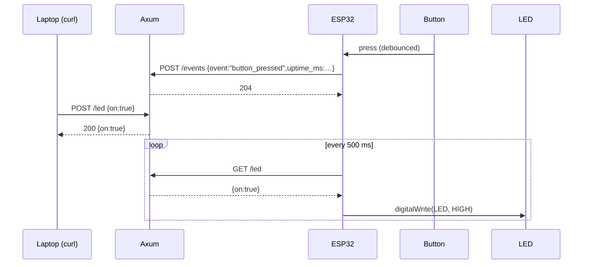

# Project 02 — Bidirectional Control

**Pattern:** request/response in both directions.

- **Device → server**: button press on the ESP32 → `POST /events` with `{"event":"button_pressed"}`.
- **Server → device**: server holds a desired LED state; the ESP32 polls
  `GET /led` every 500 ms and updates the onboard LED. A `curl -X POST /led -d '{"on":true}'`
  from your laptop flips the LED within half a second.

This is the simplest way to give a microcontroller a remote-control
channel without WebSockets or MQTT. Latency ≈ half the poll interval.
Use Server-Sent Events or WebSockets when you need lower latency
(future module).

## Files

```text
projects/02-bidirectional-control/
├── README.md
├── platforms/
│   └── esp32/
│       ├── platformio.ini
│       ├── src/
│       │   ├── main.cpp
│       │   └── secrets.h.example
│       ├── scripts/flash.sh
│       └── README.md
└── server/
    ├── Cargo.toml
    ├── src/main.rs
    ├── scripts/run.sh
    └── README.md
```

## Wiring

Same as [Module 01 ESP32](../../../01-digital-io/platforms/esp32/):

- Button: **GPIO 4** → button → GND (internal pull-up, no external resistor)
- LED:    **GPIO 2** → 220 Ω → LED anode → LED cathode → GND (or just use the onboard LED on GPIO 2)

## Sequence



## Run

In one shell:

```bash
cd modules/05-wireless-wifi/projects/02-bidirectional-control/server
cargo run --release
```

Find your laptop IP: `ipconfig getifaddr en0` (macOS) or `hostname -I` (Linux).

In another shell:

```bash
cd modules/05-wireless-wifi/projects/02-bidirectional-control/platforms/esp32
cp src/secrets.h.example src/secrets.h
# Edit secrets.h: WIFI_SSID, WIFI_PASSWORD, SERVER_BASE_URL (e.g. http://192.168.1.42:8080)
pio run --target upload && pio device monitor
```

Then drive it:

```bash
# Flip the LED on
curl -X POST http://<laptop-ip>:8080/led \
     -H 'content-type: application/json' \
     -d '{"on":true}'

# Flip it off
curl -X POST http://<laptop-ip>:8080/led \
     -H 'content-type: application/json' \
     -d '{"on":false}'

# Read current desired state
curl http://<laptop-ip>:8080/led

# See the events log (every press from the ESP32 is here)
curl http://<laptop-ip>:8080/events
```

The HTML page at `http://<laptop-ip>:8080/` has a one-click form to flip
the LED and shows the recent event log.

## Expected behavior

- Press the button on the ESP32 → within ~50 ms, a new row in `/events`.
- POST `{"on":true}` to `/led` → within ~500 ms, the onboard LED lights up.
- Server restart wipes state (it's all in-memory). The ESP32's next
  `GET /led` returns `{"on":false}` and the LED turns off.

## Common pitfalls

- The same Wi-Fi / firewall / IP-not-localhost gotchas as Project 01 —
  see [`../01-telemetry-uplink/README.md`](../01-telemetry-uplink/README.md#what-to-look-for).
- **LED doesn't toggle:** check the serial monitor for `[led] GET …` log
  lines. If they're missing, the polling task isn't running. If they're
  there but the value never changes, the server isn't seeing your
  `curl` (firewall? wrong IP?).
- **Two presses count as one:** the firmware debounces in the ISR. If
  you genuinely want double-press detection, lower `kDebounceMs`.
