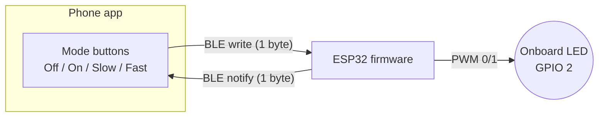

# Module 06 — Wireless BLE

## Goal

Control the ESP32 onboard LED from a phone over **BLE GATT**. Four
modes: off, on, slow blink (500 ms), fast blink (100 ms). Selected
mode is echoed back via a notify characteristic so the app can display
the truth about the ESP32's current state.

Paired with the [`apps/ble-led-controller/`](../../apps/ble-led-controller/)
React Native + Expo app.



## Concepts

- Custom BLE GATT service with **two characteristics**: one WRITE (mode
  select), one NOTIFY (current mode readback).
- Non-blocking blink loop in firmware — no `delay(500)` calls that would
  stall BLE.
- Toggle-based state machine: the firmware owns the timing; the phone
  only ever sets the *desired* mode.

## Prerequisites

- [Module 00](../00-getting-started/) — ESP32 toolchain working.
- [Module 01](../01-digital-io/) — GPIO output basics.
- Familiarity with the shape of [Module 07 project 01](../07-robot-car/projects/01-ble-control/) helps but isn't required — this module is a simpler warm-up.
- A phone you can install a custom Expo dev build on.

## Hardware Matrix

| Board             | Folder                              | Status                     |
| ----------------- | ----------------------------------- | -------------------------- |
| ESP32 (WROOM-32D) | [`platforms/esp32/`](./platforms/esp32/) | implemented             |
| Others            | —                                   | not applicable (no BLE) / planned for Pico W |

## Bill of Materials

See [`bom.md`](./bom.md). Just an ESP32 + USB cable. The GPIO 2 onboard
LED is the target; no external wiring required.

## Wireless / GATT identifiers

| Thing                       | Value                                          |
| --------------------------- | ---------------------------------------------- |
| Advertised device name      | `HOR-LED-BLE`                                  |
| Service UUID                | `9a70b2e0-4b1a-4b0e-9a2a-1c1c1c1c0001`         |
| Mode characteristic (WRITE) | `9a70b2e0-4b1a-4b0e-9a2a-1c1c1c1c0002`         |
| State characteristic (NOTIFY) | `9a70b2e0-4b1a-4b0e-9a2a-1c1c1c1c0003`       |

The base UUID is a private randomly-generated one (last few digits vary
per characteristic). Not a standard Bluetooth SIG service.

## Wire protocol

**Both characteristics carry a single byte** with these meanings:

| Byte | Mode      | LED behavior                     |
| ---- | --------- | -------------------------------- |
| 0    | off       | always off                       |
| 1    | on        | always on                        |
| 2    | slow      | blink at 500 ms period (1 Hz)    |
| 3    | fast      | blink at 100 ms period (5 Hz)    |

Any other value → treated as `0` (safe default).

## Build & Run

```bash
cd modules/06-wireless-ble/platforms/esp32
pio run --target upload && pio device monitor
```

Then in the app: Drive tab → Connect → tap a mode button.
See [`apps/ble-led-controller/`](../../apps/ble-led-controller/).

## Expected Behavior

- Boot: LED is OFF, serial logs `[ble] advertising as HOR-LED-BLE`.
- Phone connects: `[ble] connected` on serial.
- Tap **On** in the app: LED lights up; phone shows "current: on".
- Tap **Slow**: LED blinks at 1 Hz; phone shows "current: slow".
- Disconnect: LED continues in its last-set mode (BLE going away doesn't
  turn the LED off). This is intentional — the LED is *state*, not a
  live telemetry channel.

## Common Pitfalls

- **Nothing shows up in the app's scan list.** The app filters on the
  service UUID (not the name), so if you changed the UUID in firmware
  you need to change it in the app too.
- **Blink is stuck at the old rate.** Watch the notify characteristic in
  nRF Connect — if the firmware isn't emitting notifies after a write,
  the client (app) is out of sync. Re-connect fixes it.
- **iOS "Bluetooth pairing" popup blocks connection.** Our GATT service
  uses no security (no pairing required). If iOS insists, forget the
  device from Settings → Bluetooth first.
- **Mac auto-connects to `HOR-LED-BLE`.** Some Macs pair with anything
  friendly-named. Forget the device from macOS Bluetooth settings so it
  doesn't hijack the phone's connection.

## Next Module

[Module 07 — Robot Car](../07-robot-car/) — extends the same BLE pattern
to control motors (and adds a WebSocket variant).
