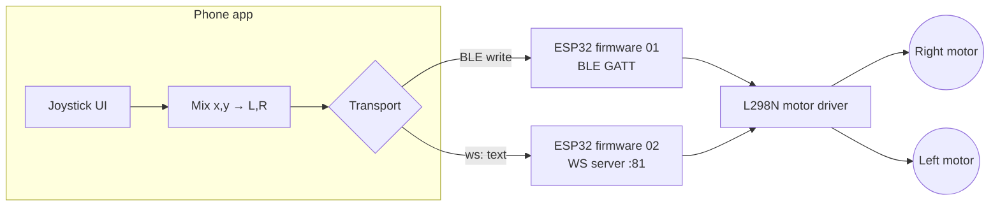

# Module 07 — Robot Car (ESP32)

## Goal

Build a 2WD differential-drive robot car driven by an ESP32 and remote-
controlled from a phone (React Native / Expo). Two firmware variants —
one over **BLE**, one over **Wi-Fi + WebSocket** — share an identical
wire protocol so the same mobile app can drive either one with the same
joystick UI.

The app lives at [`apps/robot-car-controller/`](../../apps/robot-car-controller/)
and has a toggle to switch between the two transports.



## Concepts

- **Differential drive mixing** — turning a 2-axis joystick into per-wheel speeds.
- **PWM motor control** on the ESP32 via `ledc`.
- **L298N H-bridge** wiring: `ENx` (PWM speed) + `INx1`/`INx2` (direction).
- **Custom BLE GATT service** with one write characteristic.
- **WebSocket server hosted on the ESP32** itself (no third machine in the loop).
- **Watchdog timeout** — fail-safe so the car stops if the radio link drops.

## Prerequisites

- [Module 00](../00-getting-started/) — ESP32 toolchain working.
- [Module 01](../01-digital-io/) — GPIO + interrupts.
- [Module 05](../05-wireless-wifi/) — Wi-Fi join + HTTP basics (useful background for the WS variant).
- A phone you can install a custom Expo dev build on (BLE requires this — see [`apps/robot-car-controller/README.md`](../../apps/robot-car-controller/README.md#ble-needs-a-dev-build)).

## Hardware Matrix

| Board               | Folder                                     | Status                     |
| ------------------- | ------------------------------------------ | -------------------------- |
| ESP32 (WROOM-32D)   | `projects/*/platforms/esp32/`              | implemented                |
| Arduino Uno         | —                                          | not applicable (no BLE/Wi-Fi) |
| Raspberry Pi Pico W | —                                          | planned                    |
| RPi 4 / Jetson      | —                                          | planned (Python + ROS2 in module 12+) |

## Bill of Materials

See [`bom.md`](./bom.md). Headline parts: ESP32 + L298N + 2× DC gear
motors + 18650 cell holder + chassis. ~$20–35 total.

## Wiring

The 6 motor pins below are the same as the reference Dabble code, so any
"ESP32 + L298N robot car" chassis you find online should drop in.

| ESP32 GPIO | L298N pin | Role                         |
| ---------- | --------- | ---------------------------- |
| GPIO 22    | ENA       | PWM speed, right motor       |
| GPIO 16    | IN1       | Direction A, right motor     |
| GPIO 17    | IN2       | Direction A, right motor     |
| GPIO 23    | ENB       | PWM speed, left motor        |
| GPIO 18    | IN3       | Direction B, left motor      |
| GPIO 19    | IN4       | Direction B, left motor      |

Diagram: [`wiring/l298n-esp32.svg`](./wiring/l298n-esp32.svg). Background reading:
[`docs/motor-driver.md`](./docs/motor-driver.md).

## Wire protocol (shared)

Both firmwares accept the **exact same text frame** so the app code is
transport-agnostic.

```text
"<left>,<right>\n"
```

- `<left>`, `<right>`: signed integers in `[-255, 255]`.
- Negative = reverse, positive = forward, zero = stop.
- `\n` terminator is optional but recommended.

Examples:

| Frame      | Behavior         |
| ---------- | ---------------- |
| `200,200`  | forward (~78 % throttle) |
| `-200,-200`| reverse          |
| `-255,255` | spin left in place |
| `255,-255` | spin right in place |
| `0,0`      | stop             |

**Watchdog:** if no frame arrives for **500 ms**, the firmware sets both
motors to 0. The app sends frames at **10 Hz** (every 100 ms) whenever the
joystick is touched, plus one immediately on release. This keeps the
control loop responsive without flooding either radio.

## Projects

| # | Project                                                                                      | Transport          | Server-side |
| - | -------------------------------------------------------------------------------------------- | ------------------ | ----------- |
| 01 | [`projects/01-ble-control`](./projects/01-ble-control/)                                       | BLE GATT           | — (peer-to-peer) |
| 02 | [`projects/02-wifi-websocket-control`](./projects/02-wifi-websocket-control/)                 | WebSocket on :81   | ESP32 hosts the WS server itself — no laptop in the loop |

## Build & Run

```bash
# --- BLE variant -----------------------------------------------------------
cd modules/07-robot-car/projects/01-ble-control/platforms/esp32
pio run --target upload && pio device monitor

# --- WiFi variant ----------------------------------------------------------
cd modules/07-robot-car/projects/02-wifi-websocket-control/platforms/esp32
cp src/secrets.h.example src/secrets.h    # fill in WIFI_SSID / WIFI_PASSWORD
pio run --target upload && pio device monitor
# Note the ESP32's IP from the serial monitor — you'll need it in the app.

# --- App -------------------------------------------------------------------
cd apps/robot-car-controller
pnpm install
pnpm start    # Expo Go for WiFi, dev build for BLE (see app README)
```

## Expected Behavior

- Phone connects (BLE or WiFi) → "Drive" tab shows green "connected" badge.
- Drag the joystick → car moves. Center the joystick → car stops within ~100 ms.
- Disconnect / lock phone / walk out of range → car stops within 500 ms (watchdog).
- Toggle between BLE and WiFi without restarting either firmware (they're independent).

## Common Pitfalls

- **Motors don't turn:** the L298N needs its own power (6–12 V), separate
  from the ESP32. The ESP32 only drives the PWM/direction signals. Don't
  try to power the motors from USB 5 V.
- **One wheel goes the wrong way:** swap the two motor wires going into
  that side's OUT1/OUT2 terminals on the L298N. No code change needed.
- **Car drifts on stop:** PWM=0 with both IN pins LOW is "coast", not
  "brake". To brake hard set both IN pins HIGH. This module uses coast.
- **BLE connects then disconnects after 5 s:** another BLE central (your
  Mac, headphones) is hijacking the connection. Forget the device from
  every other host.
- **WebSocket times out:** ESP32 and phone aren't on the same subnet, or
  the WS port (81) is blocked. Check `pio device monitor` for the IP.
- **Phone freezes after a few seconds:** you're sending faster than 10 Hz
  and overflowing the BLE TX queue. Keep the send rate ≤ 20 Hz.

## Next Module

[Module 08 — Robot Car Kinematics](../08-robot-car-kinematics/) — adds
encoders, odometry, and closed-loop velocity control. *(Planned.)*
